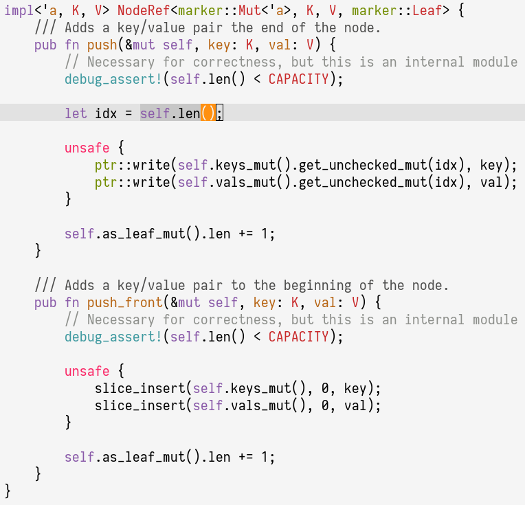

# `rustdoc`-like Emacs theme

## Installation

Put `rustdoc-theme.el` in a directory such as `~/.emacs.d/elisp` and then add
the directory to the `custom-theme-load-path` variable in the Emacs
configuration file:

~~~lisp
;; add this to ~/.emacs or ~/.emacs.d/init.el
(add-to-list 'custom-theme-load-path "~/.emacs.d/elisp")
~~~

